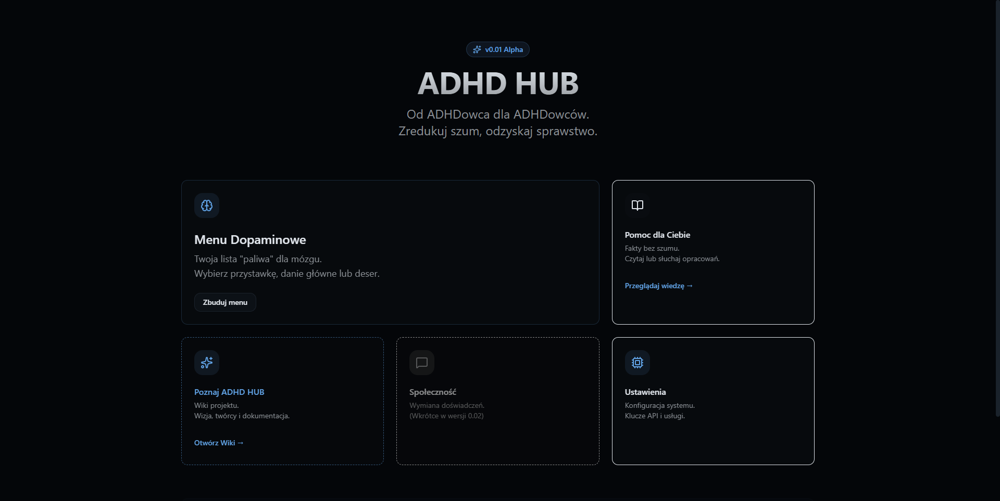
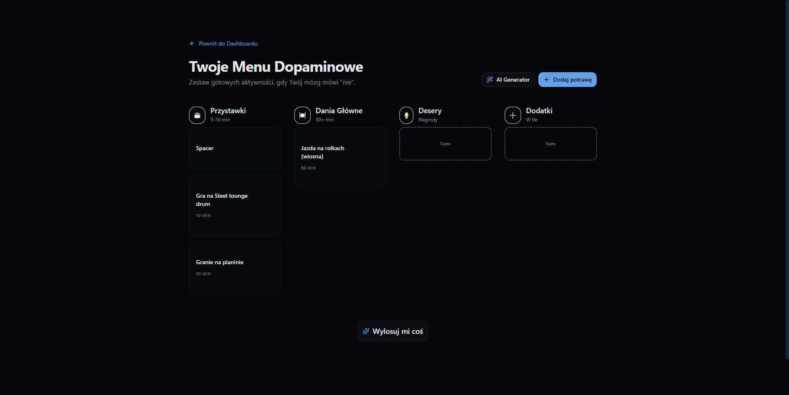
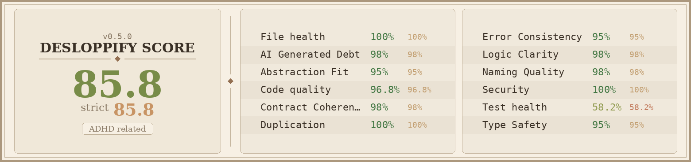

# ADHD HUB v1.0.0-alpha 🧠✨

[English](#english) | [Polski](#polski)

---

## Stop fighting your brain. Start working with it.

ADHD HUB is an open-source, **local-first** cockpit designed specifically for neuroatypical minds. We skipped the clutter, the notifications, and the "productivity hacks" that don't work. Instead, we built a tool that respects your executive functions and protects your focus.

  

### 🚀 Key Features

- **Sensory-Friendly Dashboard:** A clean, bento-grid layout that reduces visual noise and decision paralysis.
- **Personal Dopamine Menu:** A curated list of "brain fuel" activities with an AI-powered setup wizard to help you get started when you're stuck.
- **Dynamic Knowledge Base:** Scientific facts and practical guides in MDX, featuring a built-in TTS (Text-to-Speech) player for easier consumption.
- **Local-First Privacy:** Your data stays on your machine. Powered by PostgreSQL and Docker, no external cloud tracking.

### 🖼 Gallery

| Feature | Preview |
| :--- | :--- |
| **Bento Dashboard** |  |
| **Dopamine Menu** |  |

### 🛠 Tech Stack

- **Frontend:** Next.js 16 (App Router) + React 19
- **Styling:** Tailwind CSS v4 + shadcn/ui (Strict WCAG 2.2 Compliance)
- **Database:** PostgreSQL + Drizzle ORM
- **Automation:** GitHub Actions (CI + AI PR Reviewer)

### 🏁 Quick Start

1. **Clone & Enter:** `git clone https://github.com/detonato300/adhd-hub.git && cd adhd-hub`
2. **Run (Windows):** Launch `start.bat`
3. **Run (Linux/macOS):** Execute `./initsystem.sh`

Visit `http://localhost:3000` and enjoy the silence.

---

## Przestań walczyć ze swoim mózgiem. Zacznij z nim współpracować.

**Status: Alpha v1.0.0**

ADHD HUB to otwartoźródłowy, **lokalny** kokpit zaprojektowany przez nas – dla nas. Pozbyliśmy się szumu, powiadomień i „metod produktywności”, które u nas nie działają. Stworzyliśmy narzędzie, które rozumie Twoje funkcje wykonawcze i chroni Twoje skupienie.

### 🚀 Co znajdziesz w środku?

- **Dashboard Sensoryczny:** Układ bento-grid, który redukuje paraliż decyzyjny i przebodźcowanie.
- **Menu Dopaminowe:** Twoja osobista lista „paliwa” dla mózgu z kreatorem AI, który podpowie Ci co robić, gdy utkniesz.
- **Baza Wiedzy:** Konkretne fakty i instrukcje obsługi w formacie MDX z odtwarzaczem audio (TTS), bo wiemy, że czasem lepiej słuchać niż czytać.
- **Prywatność Local-First:** Twoje dane są bezpieczne w Twoim Dockerze. Żadnego śledzenia w chmurze.

### 📊 Jakość Kodu

Projekt jest monitorowany przez **Desloppify**, aby zapewnić najwyższe standardy bez długu technicznego.

### 🤝 Współpraca

Chcesz pomóc? Przeczytaj nasz [Przewodnik Współpracy](./CONTRIBUTING.md). Każdy PR przechodzi automatyczną recenzję AI!

### 📄 Licencja

Projekt na licencji **MIT**. Szczegóły w pliku [LICENSE](./LICENSE).

---
*Built with care for neurodivergent brains.* 🧠✨
